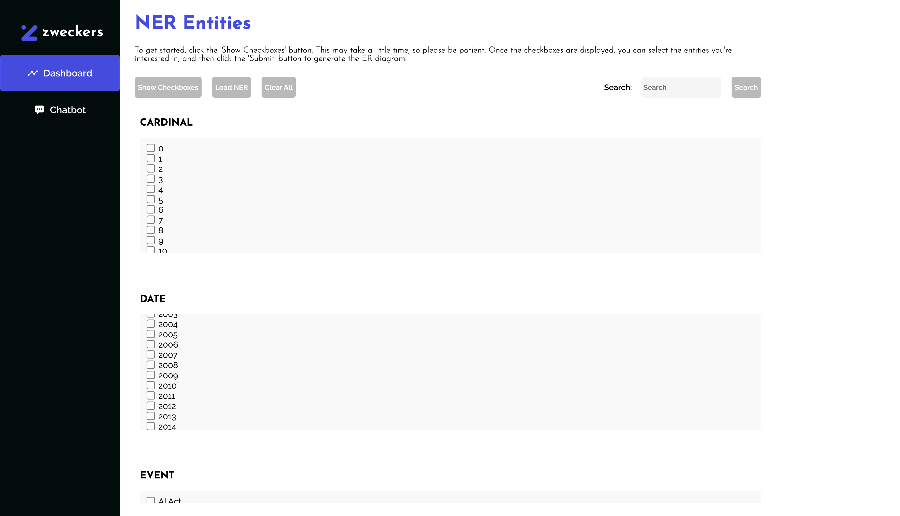
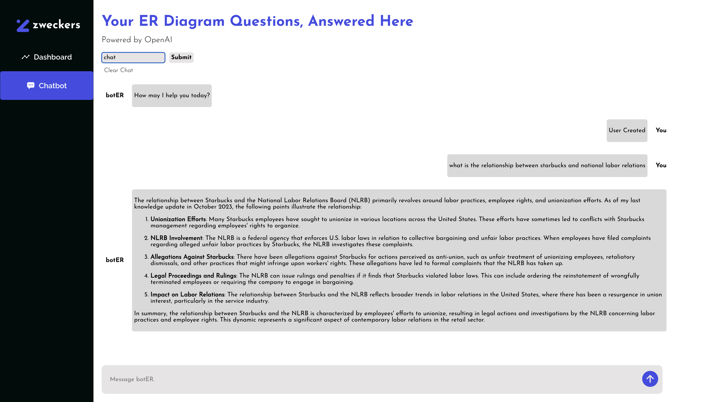

# Entity Relationship (ER) Visualisation and Chatbot App

This application is aimed to accelerate the analysis of relationships of any data with an interactive ER diagram and will have salient features including:

1️⃣ **Relationship Extraction:** Application automatically extracts all the r/s from the dataset and presents complete insight into how entities are interconnected.
   
2️⃣ **Dynamic Filtering:** Relationships can be filtered by selecting specific entities through the use of checkboxes, and upon selecting, the application updates the ER diagram on the fly to show the relevant relationships for better clarity and focus.

2️⃣ **Integration of an Interactive Chatbot:** The application offers a chatbot that can take an image of either the ER diagram or a selected row of data and process it. Then, it waits for the user to enter something and hence query the dataset based on the visualized relationships or selected data.

---

## 📑 Table of Contents
1. [🚀 Setup Instructions](#-setup-instructions)
2. [🛠️ App Usage](#-app-usage)
   - [📊 Dashboard](#-dashboard)
   - [💬 Chatbot](#-chatbot)
3. [📝 Notes](#-notes)
4. [🖼️ Screenshots](#-screenshots)
5. [🛠️ Technologies Used](#-technologies-used)
6. [📹 Video Demonstration](#video-demonstration)
7. [📜 License](#-license)
8. [🤝 Contributing](#-contributing)

---

## 🚀 Setup Instructions

Follow these steps to set up and run the app locally:

## ⚠️ Prerequisites
Make sure you install anaconda first. The link can be found here: https://docs.anaconda.com/anaconda/install/

### 1️⃣ Clone the Repository
```bash
git clone git@github.com:clarequek/zweckers.git
cd .../zweckers
```

### 2️⃣ Activate Virtual Environment
```bash
conda create --name venv python=3.11
conda activate venv
```

### 3️⃣ Install Python Libraries
```bash
pip install -r requirements.txt
python -m spacy download en_core_web_sm
```

### 4️⃣ Install Node.js Dependencies
```bash
cd app
npm install
```

### 5️⃣ Run Backend Servers 

### 🔑 API Key Setup  
Before running the chatbot backend, you **must** set up your **DeepSeek API key**. 

Insert your API Key in both **'main.py'** files in **chatbot** and **ner_diagram** at **client = Groq(api_key="your_api_key")** with the quotation marks ("").

#### Backend 1 (NER Diagram): 
```bash
cd ner_diagram
python main.py
```

#### Backend 2 (Chatbot):
```bash
cd ../chatbot
python main.py
```
### 6️⃣ Start the Frontend App
```bash
cd ../../app
npm start
```
The app should now be running on **http://localhost:3000**.

---

## 🛠️ App Usage

### 📊 Dashboard
- Visualise relationships between entities using an ER diagram generated with PlantUML.
- Click **"Show Checkbox"** to display the list of entities.
- Click **"Load NER"** to load the entities.
- Select entities (e.g., **"Starbucks"** and **"National Labor Relations Board Judge"**).
- Press **"Submit"** to generate the ER diagram.
- Click **"Clear All"** to clear selections and start over.

### 💬 Chatbot
- Query the relationships visualised in the Dashboard.
- Create a new chat by naming the chat and clicking **"Submit"**.
- Start chatting (e.g., **"What is the relationship between Starbucks and National Labor Relations Board Judge?"**).
- Clear History by clicking **Clear Chat**

---

## 📝 Notes
- **Switching Between Dashboard and Chatbot:** There is a known bug where switching between the Dashboard and Chatbot requires reloading the Dashboard to refresh the data.
- **Searching of Entities:** Currently, the search function does not work so user must manually search using **"Ctrl+F** or **Cmd+F**
- Ensure **both backend servers** (NER Diagram and Chatbot) are running before using the app.

---

## 🖼️ Screenshots
### 📊 Dashboard


### 💬 Chatbot
  

---

## 🛠️ Technologies Used
- **Frontend:** React.js ⚛️
- **Backend:** Python (Flask/FastAPI) 🐍 || GroqAI (Model: deepseek-r1-distill-llama-70b) 🤖 || Firebase (Firestore) 🔥
- **Visualisation:** PlantUML 🖥️
- **Chatbot:** Groq (Groq API)  🤖 (Referenced Github Repository from: https://github.com/binary-hood/ChatBot-Starter)

---

## 📹 Video Demonstration
Watch our video demonstration on YouTube here: [https://www.youtube.com/watch?v=nBZCBYGB-m8&t=12s ](https://youtu.be/nBZCBYGB-m8)

---

## 📝 Made By
- Ow Zheng Wei [[🐳](https://github.com/zzhengweii)]
- Clare Quek Ying Han [[🐤](https://github.com/clarequek)]
- Lee Wen Yeong [[🦁](https://github.com/harvestingmoon)]
- Eunice Gong Shi Min [[🐱](https://github.com/Eun18)]

---

## 📜 License
This project is licensed under the **MIT License**. See [MIT License](LICENSE) for details.

---

## 🤝 Contributing
Contributions are welcome! Please open an **issue** or submit a **pull request**. 🚀

---


